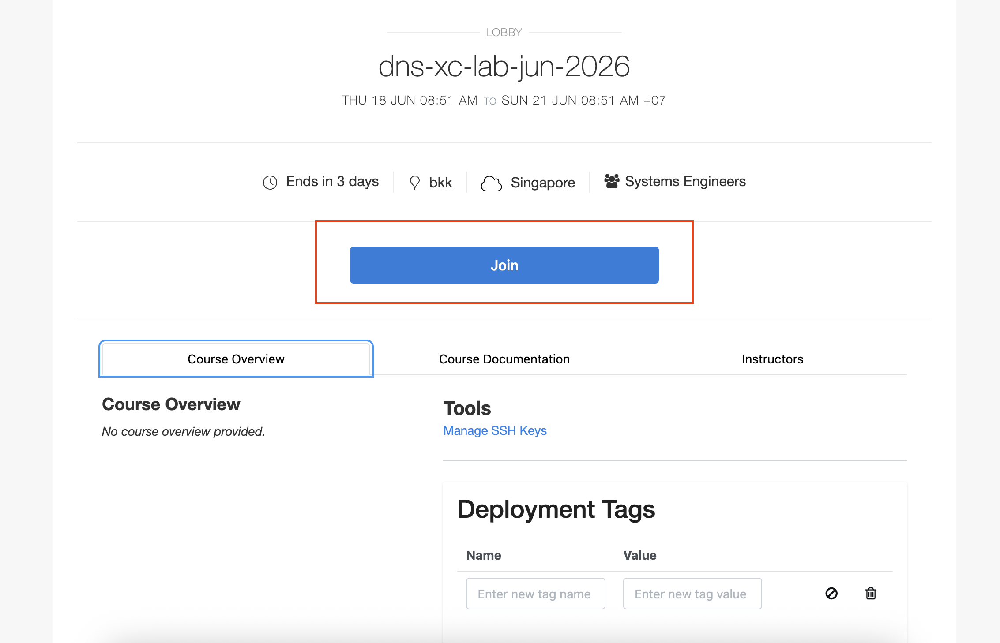
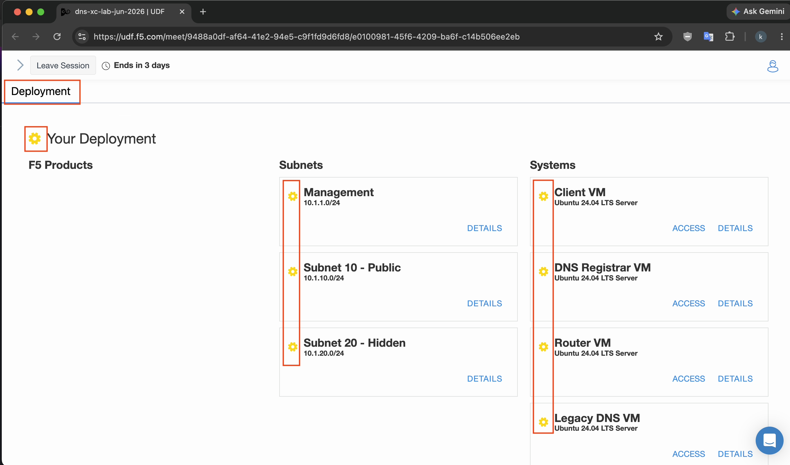
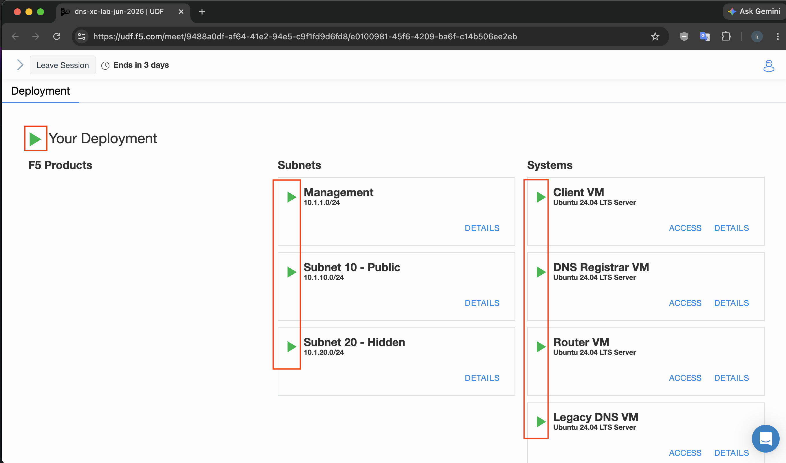
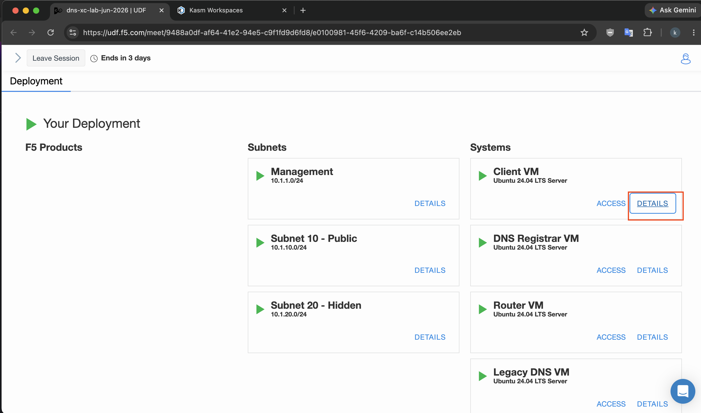
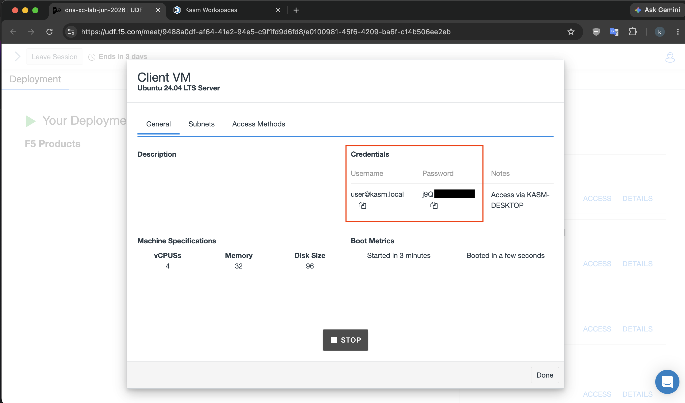
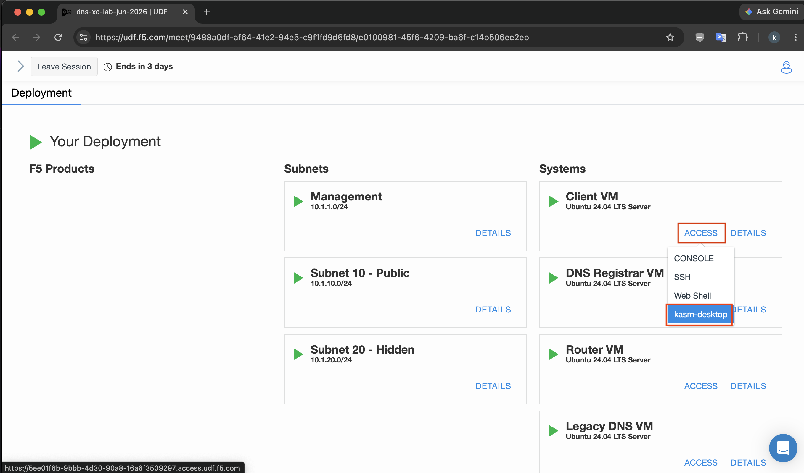
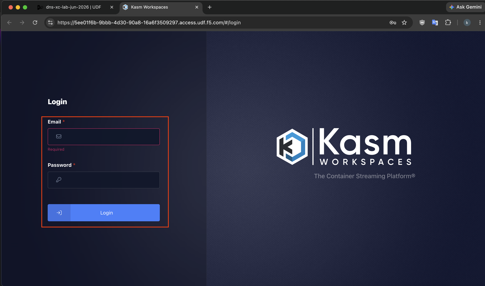

# How to Access Lab Environment

## 📋 Overview

Before starting the F5 Distributed Cloud DNS labs, you need to access the lab environment through **F5 UDF (Unified Demo Framework)** and **Kasm Workspaces**. This guide will walk you through the steps to access and set up your lab environment.

---

## 🎯 Prerequisites

| Item | Details |
|------|---------|
| **UDF Account** | F5 UDF account with access to the DNS lab course |
| **Web Browser** | Modern browser (Chrome recommended) |
| **Course Name** | dns-xc-lab-jun-2026 |

---

## 📝 Access Instructions

### Step 1: Access UDF Course

1. Log in to **F5 UDF** (Unified Demo Framework) at [https://udf.f5.com](https://udf.f5.com)

2. Navigate to your enrolled course: **dns-xc-lab-jun-2026**

3. You will see the course overview page showing:
   - **Course Title:** dns-xc-lab-jun-2026
   - **Status:** Running (with time remaining)
   - **Options:** End in 4 days, Snooze, Autogrow, Restrict Egress
   - **Join** button (highlighted in the red box)

4. Click the **"Join"** button to access the lab deployment.

---

### Step 2: View Your Deployment

After joining the course, you will see the **Deployment** page showing your lab environment:

1. Click on the **"Deployment"** tab (highlighted in the red box) to view your deployment.

2. You will see **Your Deployment** section with:
   - **F5 Products** - Available F5 products
   - **Subnets:**
     - Subnet 10 - Public
     - Subnet 20 - Hidden
   - **Systems:**
     - Client VM
     - DNS Registrar VM
     - Router VM
     - Legacy DNS VM
     - Legacy DNS VM 2

> **⏳ Important:** Wait for all virtual machines to start successfully. You will see a **yellow gear icon** ⚙️ while the VMs are starting. Wait until the icon changes to **green** ✅ before proceeding to the next step.

---

### Step 3: Deployment Full View

> **✅ Ready to proceed:** When all virtual machines are ready, you will see a **green icon** next to each system. This indicates that all VMs have started successfully and are ready for use.

---

### Step 4: Select Client VM

To access the lab environment, you need to connect to the **Client VM**:

1. In the **Systems** section, locate **Client VM** (highlighted in the red box).

2. Click on **Client VM** to select it.

3. Click the **"DETAILS"** button (highlighted in the red box) to view the access options for the Client VM.

---

### Step 5: Copy Credentials

After clicking the DETAILS button, you will see the Client VM details:

1. The **Client VM** is now selected

2. You will see the **Credentials** section showing:
   - **Username:** (e.g., `user@kasm.local`)
   - **Password:** (auto-generated password)

3. **Copy the credentials** (highlighted in the red box) — you will need these to log in to Kasm Workspaces in the next steps.

> **💡 Tip:** Click the copy icon next to the credentials to copy them to your clipboard. Keep these handy for the Kasm login step.

---

### Step 6: Choose Access Method

You will see the **Access Methods** dialog for the Client VM:

1. A dialog will appear showing available access methods for the Client VM.

2. You will see options including:
   - **Description** - VM details
   - **Documentation** - Related documentation
   - **Access Methods:**
     - SSH
     - RDP
     - **KASM** (recommended for this lab)

3. Click on **"KASM"** (highlighted in the red box) to launch the Kasm Workspaces environment.

---

### Step 7: Kasm Workspaces Login

You will be redirected to the **Kasm Workspaces** login page:

1. You will see the **Kasm Workspaces** login page with the logo "The Container Streaming Platform®"

2. Enter your credentials in the **Login** form (highlighted in the red box):
   - **Email:** Your lab email (e.g., `user@kasm.local`)
   - **Password:** Password provided by your instructor

3. Click the **"Login"** button to access the Kasm desktop.

---

## ✅ What's Next?

After logging into Kasm Workspaces, you are ready to start the labs:

| Lab | Topic | Description |
|-----|-------|-------------|
| **Lab 1** | DNS Availability | Eliminate single-provider DNS dependency |
| **Lab 2** | Attack Mitigation | XC DNS absorbs DDoS attacks in real-time |
| **Lab 3** | Hidden Primary | Hide BIND behind XC DNS for maximum protection |

> **💡 Tip:** Proceed to **Lab 1** to begin your F5 Distributed Cloud DNS training. The lab interface will guide you through each step.

---

## 🔧 Troubleshooting

| Issue | Solution |
|-------|----------|
| Cannot access UDF | Verify your F5 UDF account credentials and course enrollment |
| Kasm login fails | Check with your instructor for correct credentials |
| Deployment not starting | Wait a few minutes and refresh the page |
| Client VM not responding | Try refreshing the browser or reconnecting |

---

## 📞 Support

If you encounter any issues accessing the lab environment, please contact your instructor or F5 support.

---

*Lab Guide Version 1.0*  
*Created for F5 Distributed Cloud DNS Training*