# F5 Distributed Cloud DNS - Lab 3: Hidden Primary DNS

## 📋 Lab Information

| Item | Details |
|------|---------|
| **Lab Name** | Lab 3 — Hidden Primary DNS |
| **Lab Objective** | The attacker cannot target what they cannot find. Hide BIND behind XC DNS for maximum protection. |
| **Duration** | ~30 minutes |
| **Prerequisites** | Lab 1 and Lab 2 completed |

---

## 🎯 Lab Objective

> The attacker cannot target what they cannot find. Hide BIND behind XC DNS for maximum protection.

---

## 📝 Lab Instructions

### Step 1: Hidden Primary DNS - Overview

Welcome to Lab 3! In this lab, you will learn how to hide your origin DNS server (Legacy BIND) behind XC DNS for maximum protection.

1. Click on **"Lab 3 — Hidden Primary"** in the left navigation.

2. You will see the lab overview with the progress bar showing:
   - **Inspect NS Records** - Find BIND IP
   - **AXFR Zone** - Pull zone to XC DNS
   - **Replace NS at Registrar** - Remove BIND NS
   - **Verify Hidden** - Confirm NS change
   - **Test Record Sync** - AXFR auto-sync
   - **Simulate Direct Attack** - Attack BIND IP
   - **BIND Fully Offline** - Ultimate test

3. The **LAB OBJECTIVE** states:
   > "The attacker cannot target what they cannot find. Hide BIND behind XC DNS for maximum protection."

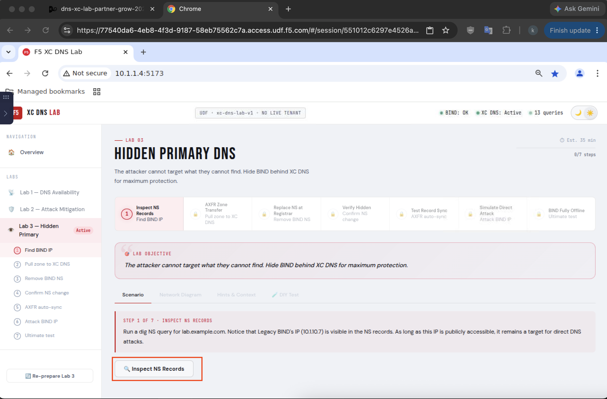

---

### Step 2: Action Complete - Find BIND IP

The first step is to inspect NS records and find the BIND IP address.

1. Click on **"Find BIND IP"** in the left navigation or **"Inspect NS Records"** in the progress bar.

2. You will see **STEP 1 OF 7 - INSPECT NS RECORDS** with instructions.

3. After completing the action, you will see the **"Action Complete"** message showing:
   - The NS query reveals 10.1.10.7 (Legacy BIND) as an authoritative nameserver
   - Anyone on the Internet can see this IP
   - An attacker who knows this IP can attack BIND directly

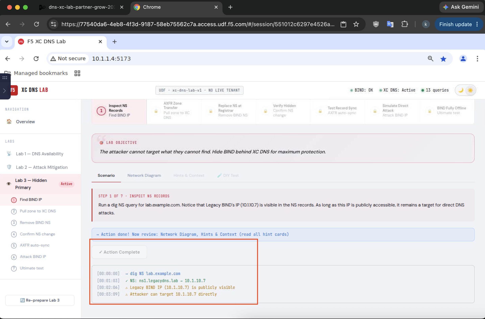

---

### Step 3: Network Diagram - Find BIND IP

Click on the **"Network Diagram"** tab to view the current topology:

**HIDDEN PRIMARY DNS FLOW:**
- Shows Legacy BIND (10.1.10.7) is publicly visible as authoritative nameserver
- Attacker can discover and target this IP directly
- The goal is to hide this origin server behind XC DNS

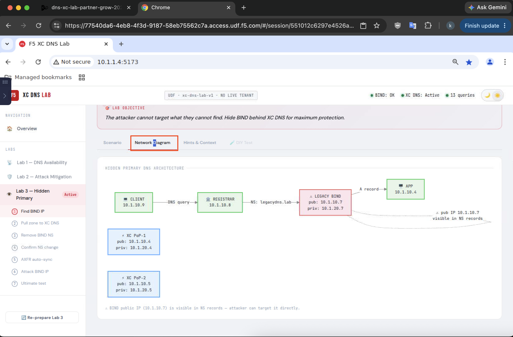

---

### Step 4: Hints & Context - Find BIND IP

Click on the **"Hints & Context"** tab to understand:

**What just happened?**
- The NS query reveals 10.1.10.7 (Legacy BIND) as an authoritative nameserver. Anyone on the Internet can see this IP. An attacker who knows this IP can attack BIND directly.

**Why does this matter?**
- Exposing your origin DNS server IP makes it vulnerable to direct attacks, bypassing any protection from XC DNS.

**Want to go deeper?**

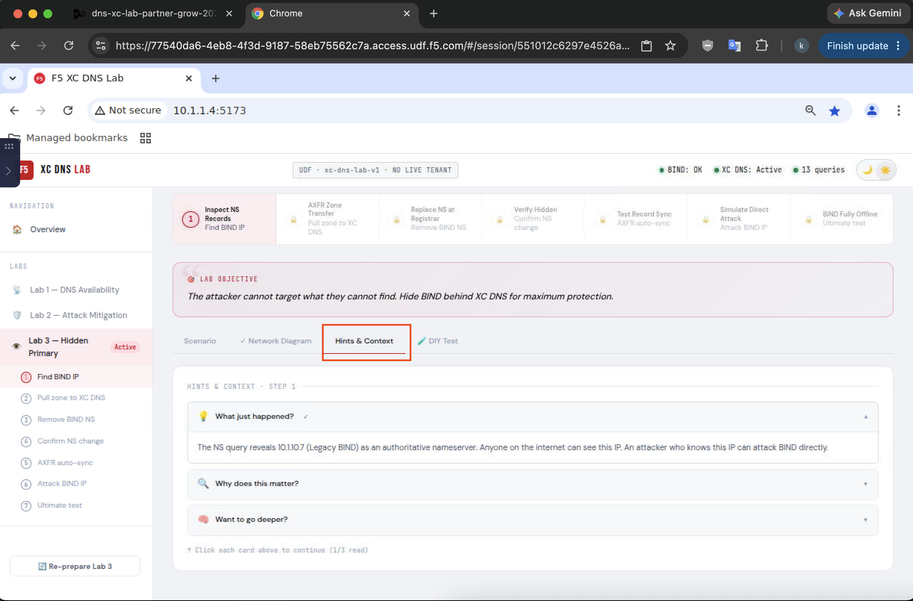

---

### Step 5: Pull Zone to XC DNS - AXFR Zone

Now we'll pull the DNS zone from Legacy BIND to XC DNS using AXFR (zone transfer).

1. Click on **"Pull zone to XC DNS"** in the left navigation or **"AXFR Zone"** in the progress bar.

2. You will see **STEP 2 OF 7 - AXFR ZONE** with instructions:
   - Transfer the DNS zone from Legacy BIND to XC DNS
   - XC DNS will become the hidden secondary, receiving zone updates via AXFR

3. Review the AXFR configuration:
   - Primary DNS: 10.1.10.7 (Legacy BIND)
   - Secondary DNS: XC DNS (will pull zone via AXFR)

4. Click the **"Trigger AXFR Zone Transfer"** button to initiate the zone transfer.

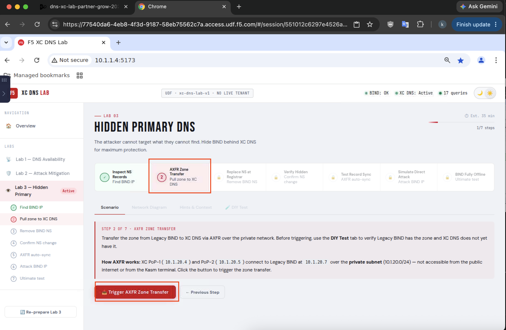

---

### Step 6: Action Complete - Pull Zone

After the zone transfer, you will see the **"Action Complete"** message showing:

- AXFR zone transfer initiated from 10.1.10.7
- Zone data successfully pulled to XC DNS
- All DNS records from Legacy BIND are now replicated in XC DNS

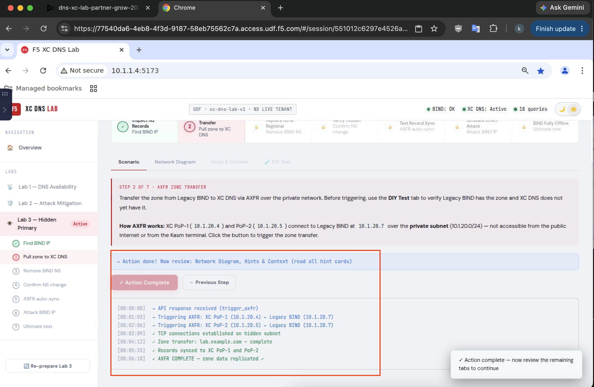

---

### Step 7: Network Diagram - Pull Zone

Click on the **"Network Diagram"** tab to view the AXFR topology:

**HIDDEN PRIMARY DNS FLOW:**
- **Legacy BIND** (10.1.10.7) Primary → AXFR zone transfer → **XC DNS** Secondary
- XC DNS now has a complete copy of the zone
- Zone updates will be automatically synchronized via AXFR

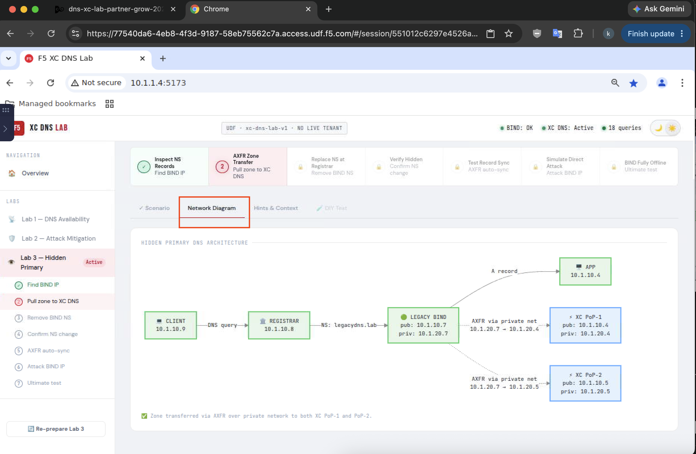

---

### Step 8: Hints & Context - Pull Zone

Click on the **"Hints & Context"** tab to understand:

**What just happened?**
- AXFR (Full Zone Transfer) is a mechanism where XC DNS as the hidden secondary pulls a complete copy of the zone file. All records from Legacy BIND are now replicated in XC DNS — without any manual re-entry.

**Why does this matter?**
- This allows XC DNS to serve authoritative responses for your domain while keeping Legacy BIND as the hidden primary for zone management.

**Want to go deeper?**

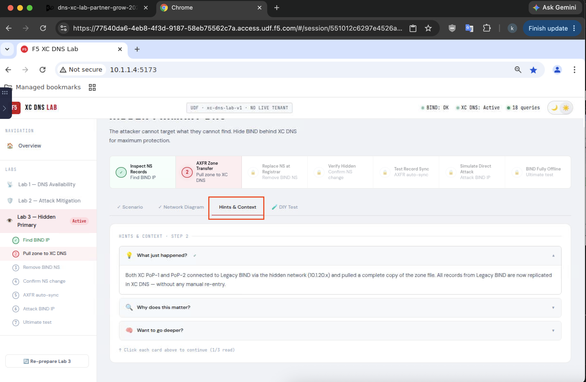

---

### Step 9: DIY Test - Pull Zone

Click on the **"DIY Test"** tab to verify the zone transfer:

**DIY Testing** — Run these commands from the **Kasm desktop terminal** to independently verify what just happened. Click to copy.

1. **Verify Legacy BIND has zone data**
2. **Query XC DNS to confirm zone was transferred**
3. **Compare records between Legacy BIND and XC DNS**

💡 **Tip:** Open a terminal in the Kasm desktop (right-click → Terminal) and paste these commands to verify results independently.

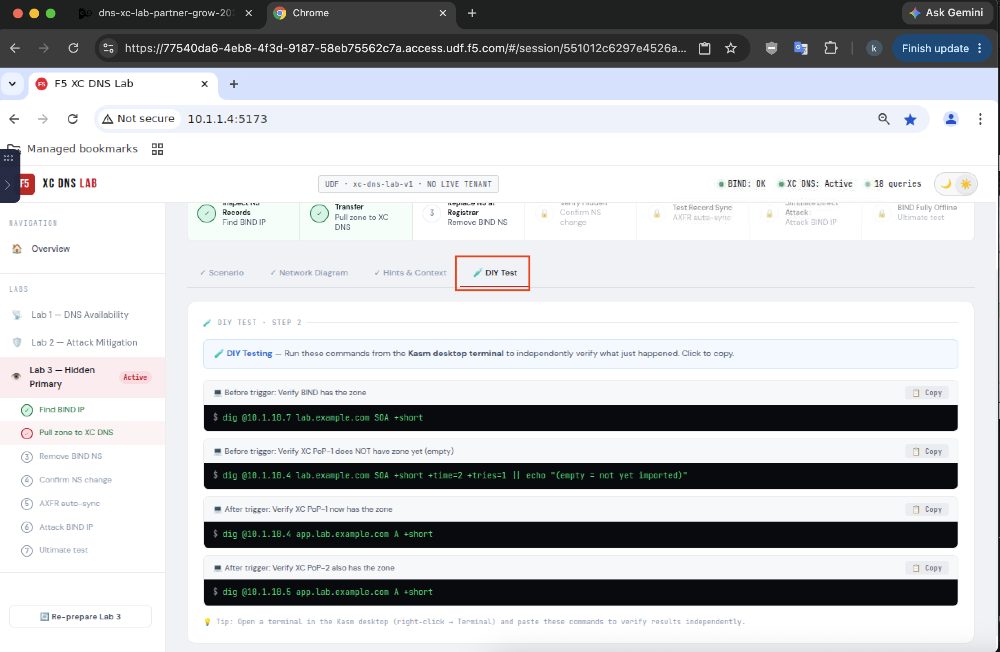

---

### Step 10: Remove BIND NS - Replace NS at Registrar

Now we'll remove Legacy BIND from the public NS records at the registrar.

1. Click on **"Replace NS at Registrar"** in the progress bair.

2. You will see **STEP 3 OF 7 - REPLACE NS AT REGISTRAR** with instructions:
   - Update the Registrar to remove Legacy BIND's NS record entirely. Only XC DNS nameservers should remain. After this, no public NS record points to 10.1.10.7 — BIND becomes invisible.

3. Click the **"Replace NS Records"** button to update the registrar.

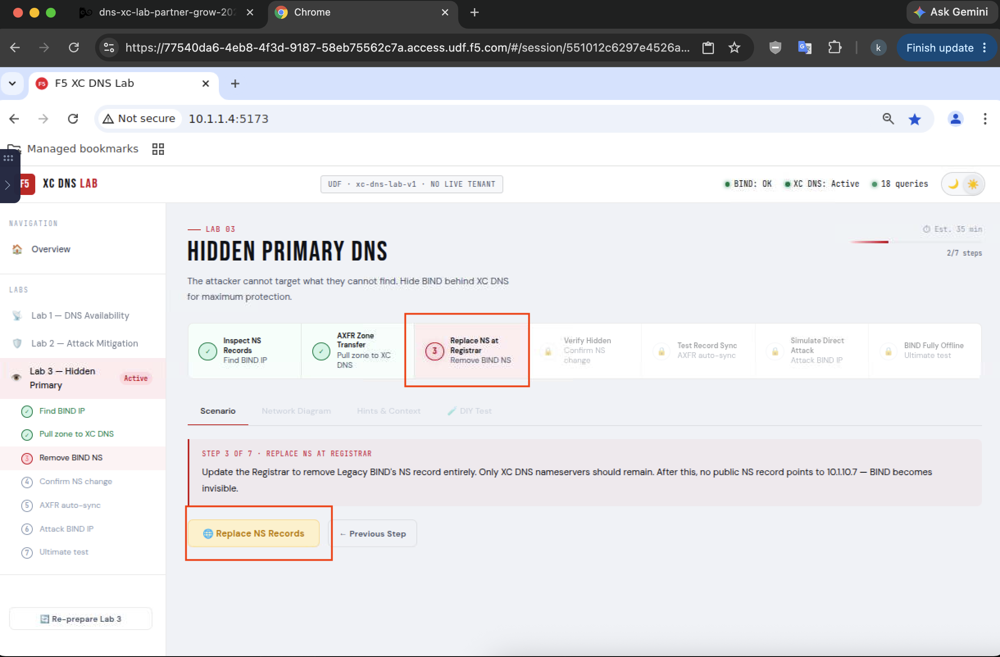

---

### Step 11: Action Complete - Remove BIND NS

After updating the registrar, you will see the **"Action Complete"** message showing:

- [00:00:00] - API response received (replace_ns)
- [00:01:03] ⚡ Updating Registrar NS records - removing Legacy BIND
- [00:02:06] ⚡ Removed: ns1.lab (10.1.10.7) - no longer visible
- [00:03:09] ✓ Added: ns1.xcpop1.lab (38.1.10.4)
- [00:04:12] ✓ Added: ns2.xcpop2.lab (38.1.10.5)
- [00:05:15] ✓ NS RECORD UPDATE COMPLETE - BIND no longer visible

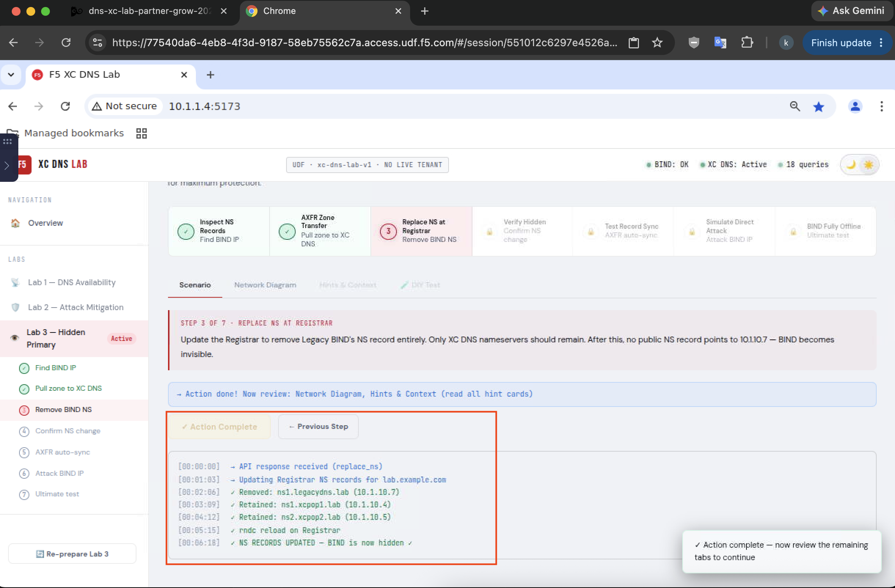

---

### Step 12: Network Diagram - Remove BIND NS

Click on the **"Network Diagram"** tab to view the updated topology:

**HIDDEN PRIMARY DNS FLOW:**
- Public NS records now only point to XC DNS (ns1.xcpop1.lab, ns2.xcpop2.lab)
- Legacy BIND (10.1.10.7) is no longer visible in public DNS
- BIND continues to operate as hidden primary, but cannot be discovered via NS queries

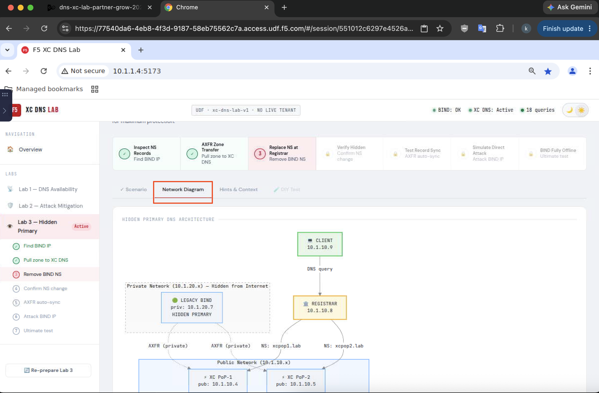

---

### Step 13: Hints & Context - Remove BIND NS

Click on the **"Hints & Context"** tab to understand:

**What just happened?**
- The registrar NS records have been updated to remove Legacy BIND. Only XC DNS nameservers are now publicly visible. An attacker querying NS records will only see XC DNS — BIND is now hidden.

**Why does this matter?**
- By removing BIND from public NS records, attackers can no longer discover your origin DNS server through standard DNS queries.

**Want to go deeper?**

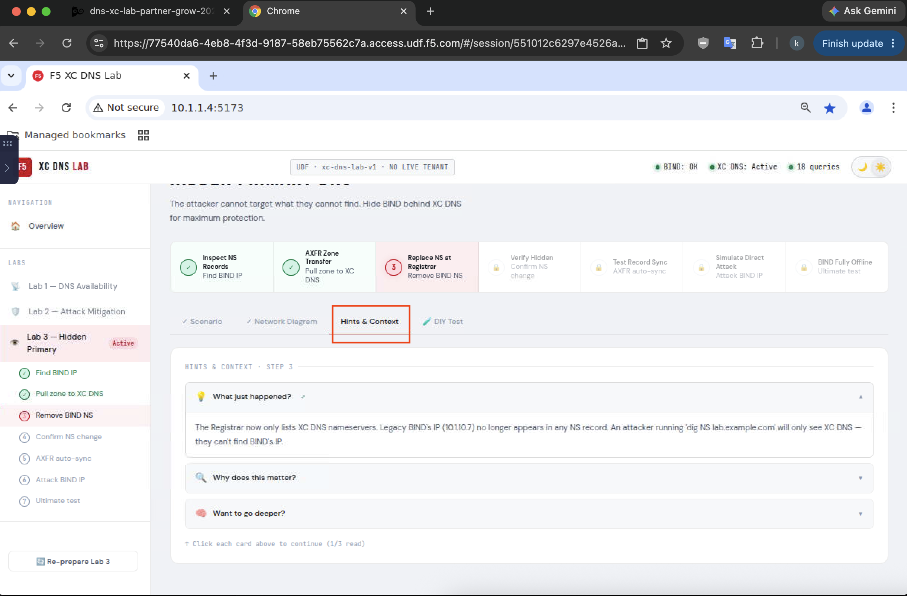

---

### Step 14: Confirm NS Change - Verify Hidden

Now let's verify that BIND is truly hidden from public DNS.

1. Click on **"Verify Hidden"** in the progress bar.

2. You will see **STEP 4 OF 7 - VERIFY HIDDEN** with instructions:
   - Flush the resolver cache and run dig NS again. Confirm that only XC DNS nameservers appear. Legacy BIND's IP should be completely absent from the public DNS.

3. Click the action button to verify the NS change.

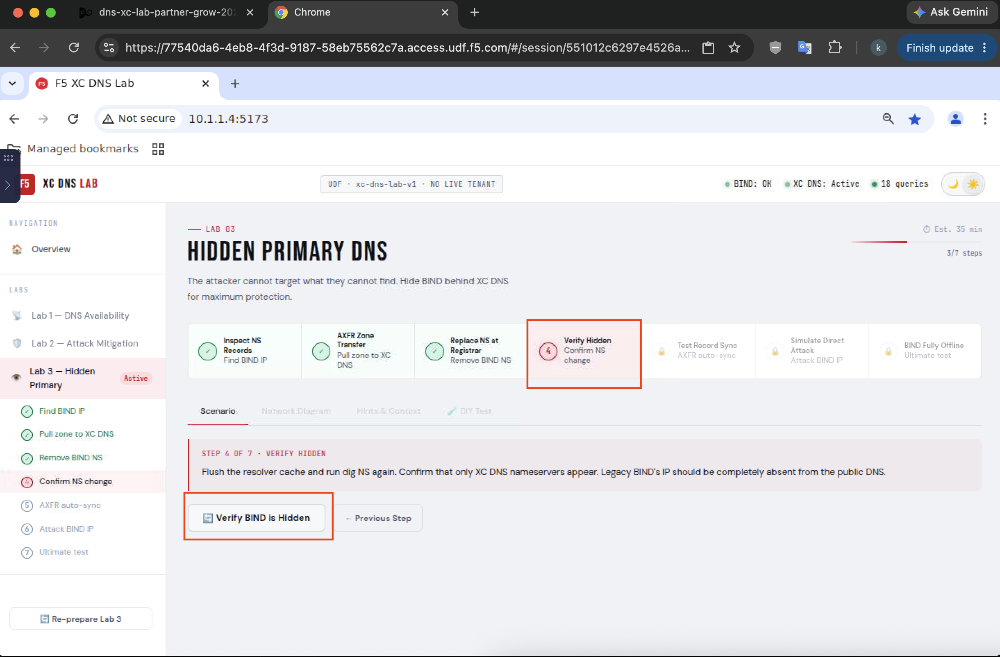

---

### Step 15: Action Complete - Confirm NS Change (BIND is HIDDEN)

After verification, you will see the **"Action Complete"** message showing:

- [00:00:00] - Flushing resolver cache
- [00:01:03] ✓ Cache cleared
- [00:02:06] - dig NS lab.example.com
- [00:03:09] ✓ NS: ns1.xcpop1.lab (38.1.10.4)
- [00:04:12] ✓ NS: ns2.xcpop2.lab (38.1.10.5)
- [00:05:15] ✓ No reference to 10.1.10.7 — **BIND is HIDDEN** ✓

---

### Step 16: Network Diagram - Confirm NS Change

Click on the **"Network Diagram"** tab to view the hidden primary topology:

**HIDDEN PRIMARY DNS FLOW:**
- **Client** → DNS query → **XC DNS** (only visible nameservers)
- **XC DNS** ← AXFR zone sync ← **Legacy BIND** (hidden primary)
- Attacker cannot discover BIND's IP through DNS queries

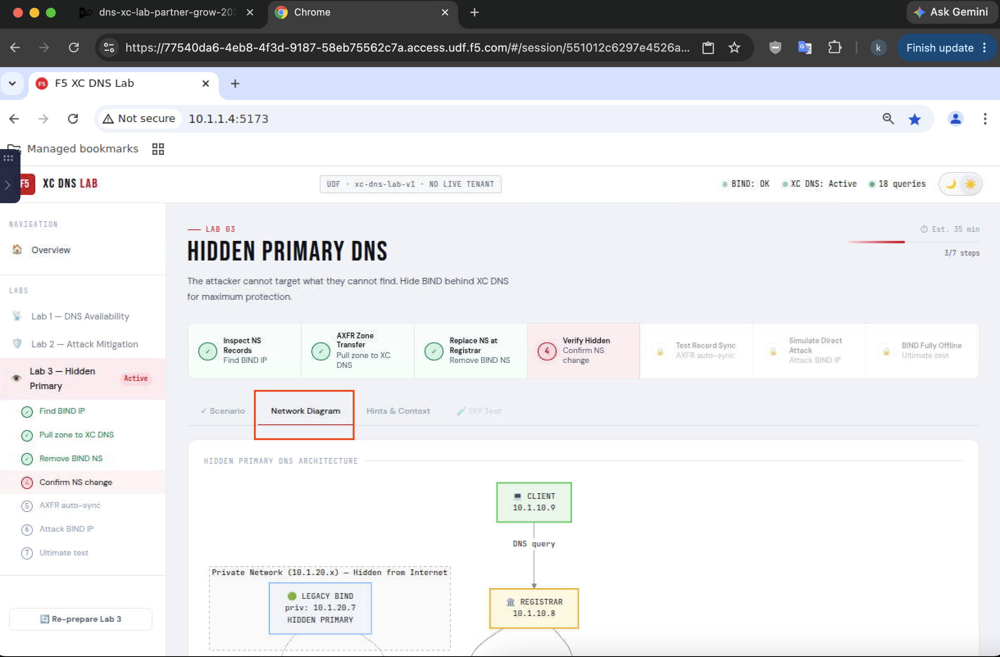

---

### Step 17: Hints & Context - Confirm NS Change

Click on the **"Hints & Context"** tab to understand:

**What just happened?**
- The NS query now only returns XC DNS nameservers (38.1.10.4, 38.1.10.5). Legacy BIND (10.1.10.7) is nowhere in the DNS — it exists only as a hidden primary in the private network.

**Why does this matter?**
- Complete DNS protection is achieved when the origin server is invisible to attackers.

**Want to go deeper?**

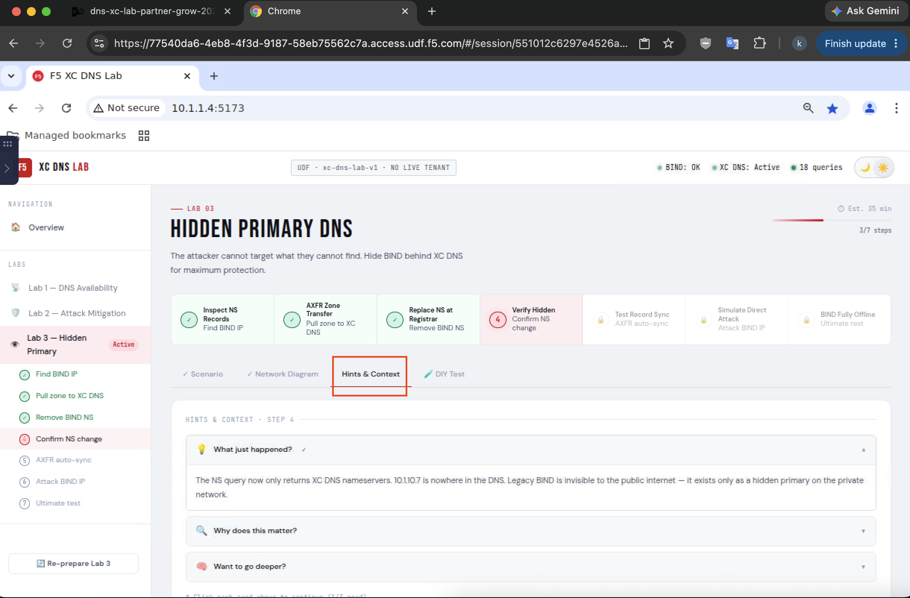

---

### Step 18: AXFR Auto-sync - Test Record Sync

Now let's test that zone changes on Legacy BIND automatically sync to XC DNS.

1. Click on **"Test Record Sync"** in the progress bar.

2. You will see **STEP 5 OF 7 - TEST RECORD SYNC** with instructions:
   - Make a record change on Legacy BIND (hidden primary) and verify it automatically syncs to XC DNS via AXFR. This proves the hidden primary architecture works for ongoing zone management.

3. Click the **"Test Record Sync"** button to test the synchronization.

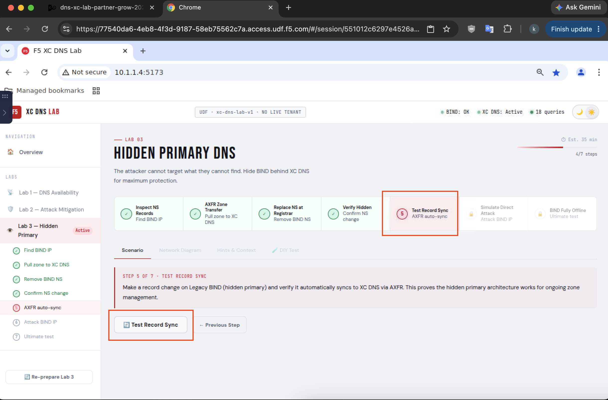

---

### Step 19: Action Complete - AXFR Auto-sync

After testing, you will see the **"Action Complete"** message showing:

- [00:00:00] - API response received (test_sync)
- [00:01:03] ⚡ Adding test record on Legacy BIND (hidden primary)
- [00:02:06] ⚡ AXFR notification sent to XC DNS
- [00:03:09] ✓ XC DNS received zone update
- [00:04:12] ✓ Test record now visible via XC DNS
- [00:05:15] ✓ AXFR SYNC WORKING - hidden primary architecture validated

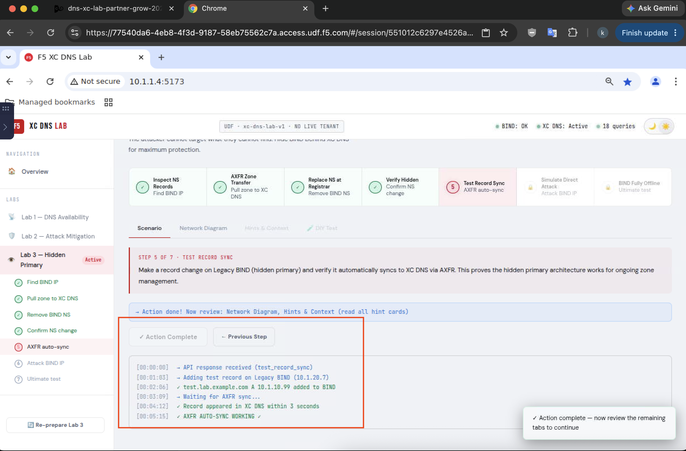

---

### Step 20: Network Diagram - AXFR Auto-sync

Click on the **"Network Diagram"** tab to view the sync flow:

**HIDDEN PRIMARY DNS FLOW:**
- **Legacy BIND** (hidden primary) → Zone change → AXFR notify → **XC DNS**
- XC DNS automatically pulls updated zone data
- Changes are reflected in public DNS responses within seconds

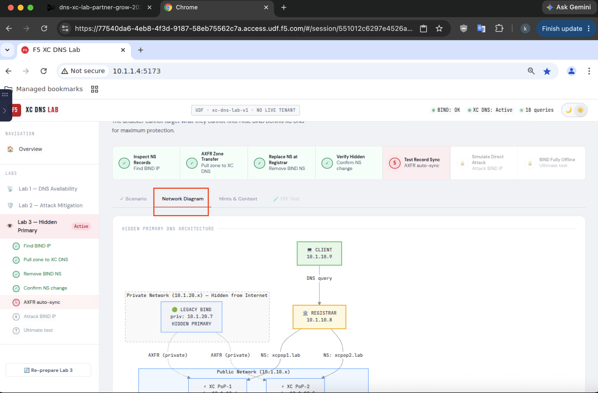

---

### Step 21: Hints & Context - AXFR Auto-sync

Click on the **"Hints & Context"** tab to understand:

**What just happened?**
- We simulated an admin making a DNS record change on Legacy BIND (10.1.10.7). Because XC DNS is configured as a hidden secondary, it automatically received the zone update via AXFR. XC DNS is now serving the updated record.

**Why does this matter?**
- The hidden primary architecture allows you to manage DNS zones on your internal server while XC DNS handles all public queries and DDoS protection.

**Want to go deeper?**

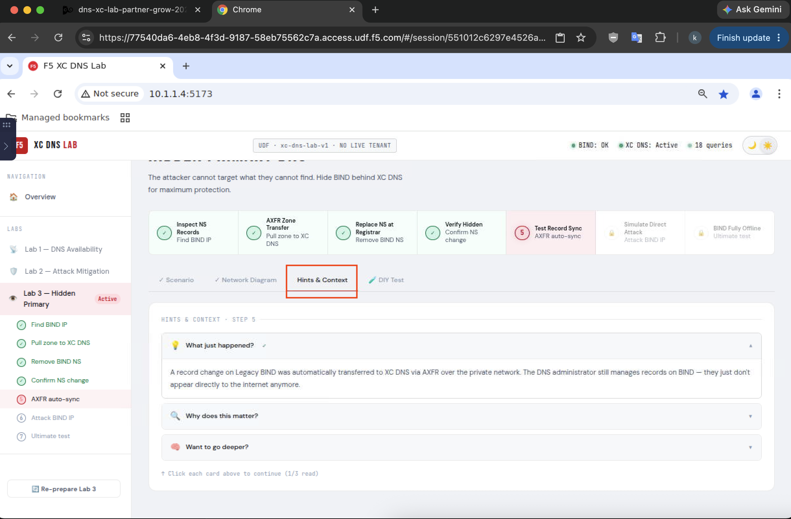

---

### Step 22: Attack BIND IP - Simulate Direct Attack

Now let's simulate what happens if an attacker tries to attack the BIND IP directly.

1. Click on  **"Simulate Direct Attack"** in the progress bar.

2. You will see **STEP 6 OF 7 - SIMULATE DIRECT ATTACK** with instructions:
   - Simulate an attacker who somehow knows Legacy BIND's old public IP (10.1.10.7) and tries to attack it directly. XC DNS should continue serving normally — the attack has no effect on DNS resolution.

3. Click the action button to simulate the attack.

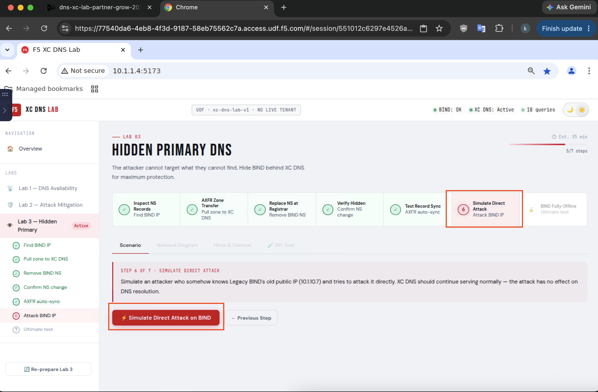

---

### Step 23: Action Complete - Attack BIND IP (No Effect)

After the simulation, you will see the **"Action Complete"** message showing:

- [00:00:00] - API response received (simulate_attack)
- [00:01:03] ⚡ Simulating attack on BIND public IP (10.1.10.7)
- [00:02:06] - Testing DNS resolution via XC DNS...
- [00:03:09] ✓ app.lab.example.com → 10.1.10.4 via XC DNS
- [00:04:12] ✓ XC DNS: unaffected — serving normally
- [00:05:15] ✓ **ATTACK ON BIND IP HAS NO EFFECT** ✓

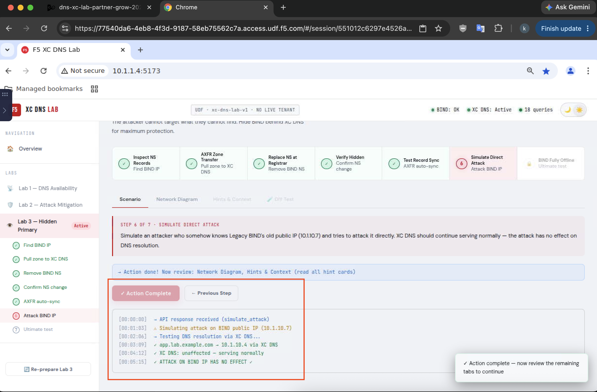

---

### Step 24: Network Diagram - Attack BIND IP

Click on the **"Network Diagram"** tab to view the attack scenario:

**HIDDEN PRIMARY DNS FLOW:**
- **Attacker** → Attack on 10.1.10.7 → **Legacy BIND** (but no longer serving public DNS)
- **Client** → DNS query → **XC DNS** → Response ✓ (unaffected)
- Attack on hidden primary has no impact on DNS service

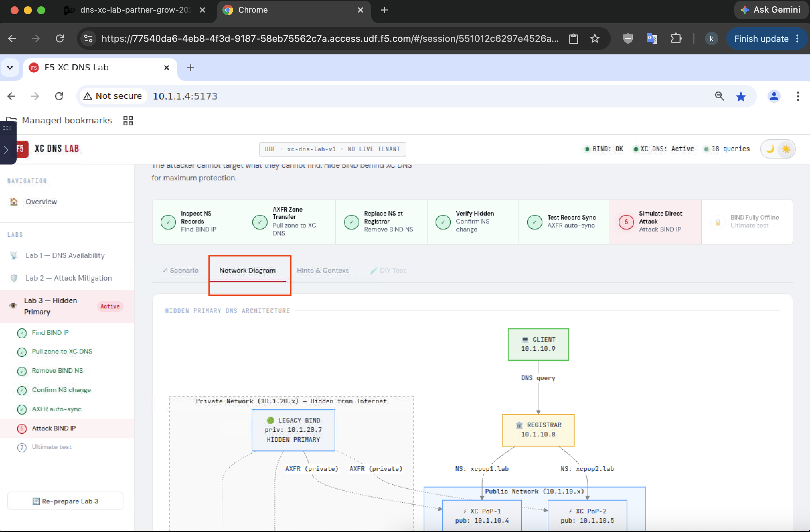

---

### Step 25: Hints & Context - Attack BIND IP

Click on the **"Hints & Context"** tab to understand:

**What just happened?**
- Even if an attacker somehow discovers the old BIND IP (10.1.10.7) and attacks it directly, DNS resolution continues normally via XC DNS. The hidden primary architecture means BIND is no longer in the critical path for public DNS queries.

**Why does this matter?**
- Complete DNS protection: even if the origin is attacked, service continues uninterrupted.

**Want to go deeper?**

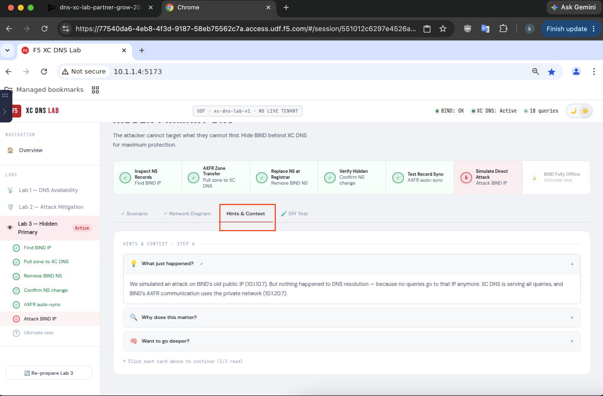

---

### Step 26: Ultimate Test - BIND Fully Offline

The ultimate test: take Legacy BIND completely offline and verify DNS continues working.

1. Click on **"Ultimate test"** in the left navigation or **"BIND Fully Offline"** in the progress bar.

2. You will see **STEP 7 OF 7 - BIND FULLY OFFLINE** with instructions:
   - The ultimate test: take Legacy BIND completely offline. Stop the named service entirely. XC DNS should continue serving from its cached zone — proving the hidden primary architecture is fully resilient.

3. Click the **"Take BIND Fully Offline"** button to stop BIND.

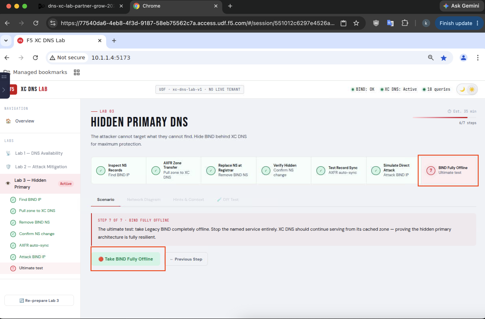

---

### Step 27: Action Complete - Ultimate Test (BIND Offline)

After taking BIND offline, you will see the **"Action Complete"** message showing:

- [00:00:00] - API response received (bind_offline)
- [00:01:03] ⚡ Stopping BIND service on 10.1.10.7
- [00:02:06] ⚡ Legacy BIND: named service stopped - OFFLINE
- [00:03:09] - Testing DNS resolution via XC DNS...
- [00:04:12] ✓ app.lab.example.com → 10.1.10.4 via XC DNS
- [00:05:15] ✓ XC DNS: still serving from cached zone
- [00:06:18] ✓ **BIND OFFLINE - DNS STILL WORKING** ✓

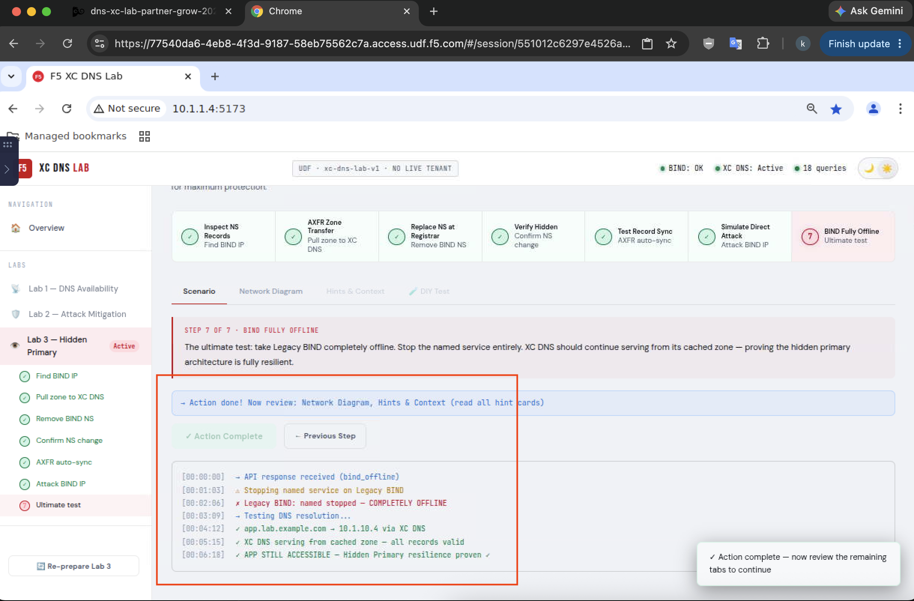

---

### Step 28: Network Diagram - Ultimate Test

Click on the **"Network Diagram"** tab to view the offline scenario:

**HIDDEN PRIMARY DNS FLOW:**
- **Legacy BIND** (10.1.10.7) — OFFLINE ✗
- **Client** → DNS query → **XC DNS** → Response ✓ (serving from cached zone)
- DNS service continues even with origin completely offline

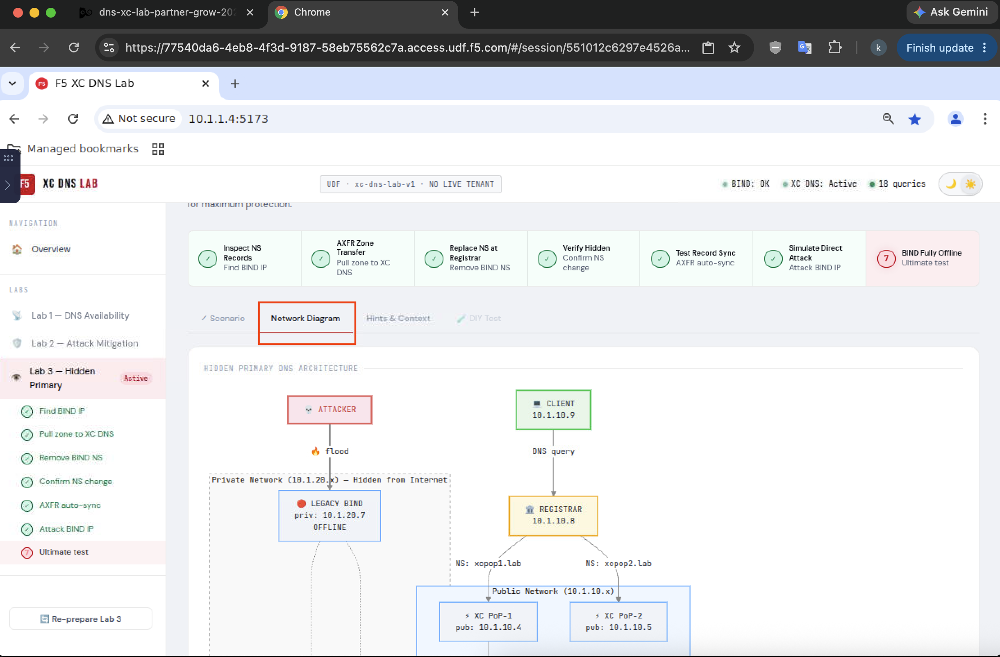

---

### Step 29: Hints & Context - Ultimate Test

Click on the **"Hints & Context"** tab to understand:

**What just happened?**
- Legacy BIND is completely offline (named service stopped), yet DNS resolution continues normally via XC DNS. This proves the hidden primary architecture provides complete resilience — even total origin failure doesn't affect DNS service.

**Why does this matter?**
- Maximum DNS availability: your DNS service survives even if the origin server fails completely.

**Want to go deeper?**

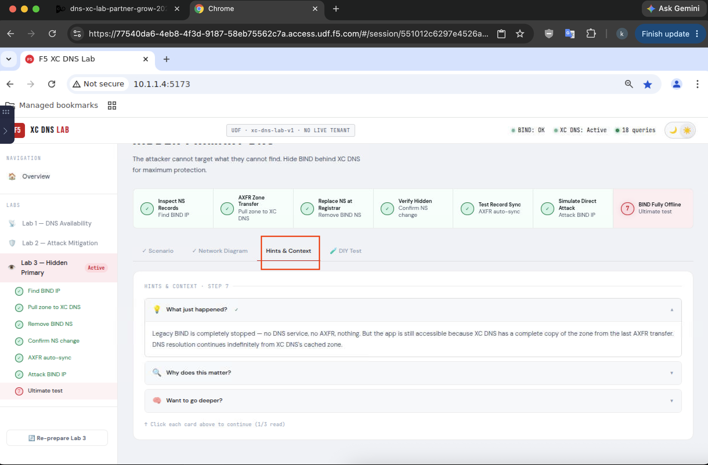

---

### Step 30: DIY Test - Ultimate Test

Click on the **"DIY Test"** tab to verify independently:

**DIY Testing** — Run these commands from the **Kasm desktop terminal** to independently verify what just happened. Click to copy.

1. **Verify BIND is offline**
2. **Query XC DNS to confirm DNS still works**
3. **Test application accessibility**

💡 **Tip:** Open a terminal in the Kasm desktop (right-click → Terminal) and paste these commands to verify results independently.

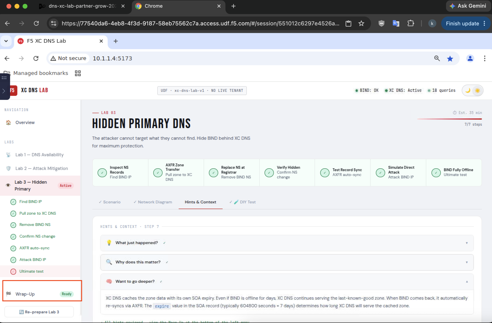

---

### Step 31: Before & After - Lab 3 Complete

Congratulations! You have completed **Lab 3 — Hidden Primary DNS** and **ALL LABS**! 🎉

**BEFORE & AFTER**

Review the complete DNS security journey — from vulnerable to invisible.

| BEFORE XC DNS | AFTER XC DNS (HIDDEN PRIMARY) |
|---------------|-------------------------------|
| BIND IP visible in public NS records | ✓ BIND IP removed from all public records |
| Attacker can target origin DNS directly | ✓ Origin DNS unreachable from Internet |
| Rate limiting helps but doesn't eliminate risk | ✓ AXFR syncs zone over private network only |
| DNS infrastructure is a known attack surface | ✓ Zero workflow change for DNS administrators |
| Sophisticated attackers bypass edge protection | ✓ Complete infrastructure protection — BIND can go offline |

**🎯 LAB 3 KEY TAKEAWAY**
> "The attacker cannot target what they cannot find. Hidden primary DNS removes the target entirely."

**📝 SELF-REVIEW QUESTIONS**
1. How did removing the BIND IP from public NS records change the attack surface?
2. What role does AXFR over the private network play in keeping zones synchronized?
3. How do the three labs together — dual primary, rate limiting, and hidden primary — create layered DNS protection?

**Next Steps:**
- Click **"All Labs Complete — Back to Overview"** to review all labs
- Or click **"Back to Lab Overview"** to revisit any lab

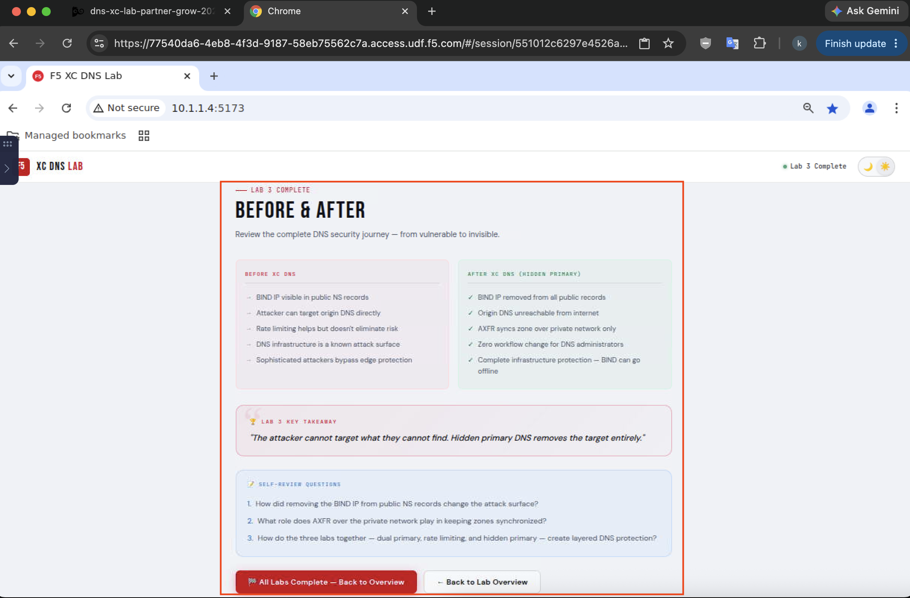

---

## 🧭 Navigation Guide

Use the **Navigation Menu** on the left side to access:

**NAVIGATION:**
- **Overview** - View lab overview

**LABS:**
- **Lab 1 — DNS Availability** (Completed)
- **Lab 2 — Attack Mitigation** (Completed)
- **Lab 3 — Hidden Primary** (Active)
  - Find BIND IP ✓
  - Pull zone to XC DNS
  - Remove BIND NS
  - Confirm NS change
  - AXFR auto-sync
  - Attack BIND IP
  - Ultimate test

---

## 📚 Additional Resources

**Tabs Available in Lab Interface:**

| Tab | Description |
|-----|-------------|
| **Scenario** | Explains the current scenario |
| **Network Diagram** | Shows network topology |
| **Hints & Context** | Provides hints and context |
| **DIY Test** | Self-testing section |

---

## ⏱️ Estimated Time

- **Lab 3 - Hidden Primary DNS:** ~30 minutes

---

## 📞 Support

If you encounter any issues during the lab, please contact your instructor.

---

*Lab Guide Version 1.0*  
*Created for F5 Distributed Cloud DNS Training*